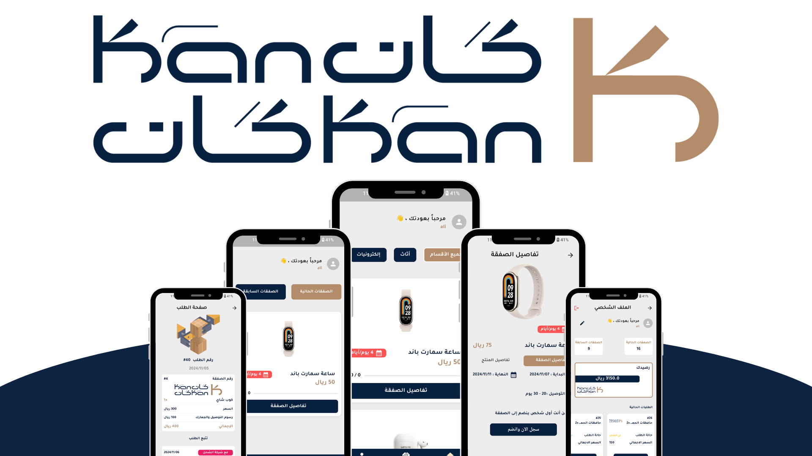
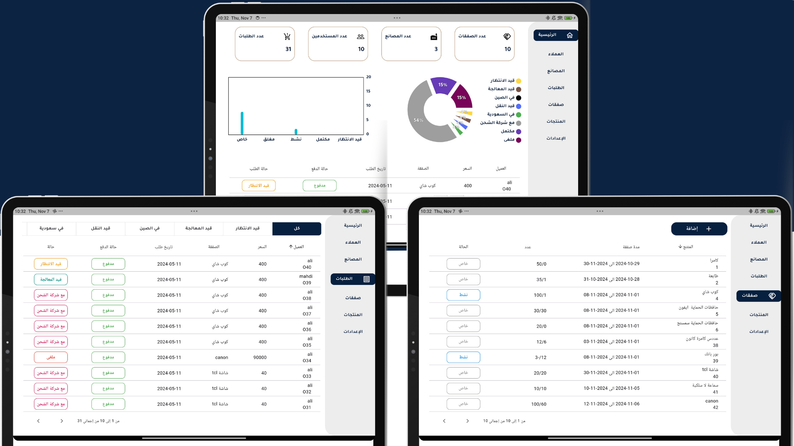

# Kan Kan App

Kan Kan is an app that facilitates group deals, allowing a specified number of users to join each deal within a defined period. This app makes it easy for users to order products from China without hassle.

## Available Applications

The Kan Kan app consists of two separate applications:
- **User Application**: Allows users to browse deals and manage orders.
- **Admin Application**: Manages users, factories, orders, and deals.

## User Application Features

- **Browse Deals as a Visitor**: Visitors can view available deals without the need to register.
- **Easy Registration**: Users can sign up with their email, phone number, and name.
- **Email Verification**: Account confirmation via verification code sent to the user’s email.
- **Profile and Balance**: View profile and balance, which increases if a user cancels a deal.
- **Browse and Join Deals**: Easily explore and join available deals.
- **Select Delivery Location and Payment**: Specify delivery location and make payments when joining a deal.
- **Order Details**: Full view of order details.
- **Real-Time Order Tracking**: Track order status in real-time without needing to refresh the page.
- **Order Cancellation and Refund**: Option to cancel an order and get a refund to the user’s balance.

## Admin Application Features

- **Dashboard**: View app statistics such as the number of users, orders, and deals.
- **User Management**: View, edit, and block users when necessary for policy violations.
- **Factory Management**: View, add, edit, and block factories if they violate agreements.
- **Order Management**: Search orders by status, view order details, and update order statuses.
- **Deals Management**: View, add, edit, and update deal statuses. Admins can also view all orders linked to each deal and update their statuses. Additionally, products from blocked factories cannot be added to deals.
- **Settings**: Allows the user to change the app language between Arabic, English, and Chinese.
- **Product Management**: Add, edit, and view products.

## Technologies Used

- **Flutter**: For building the user interface.
- **Melos**: For package management.
- **Supabase**: As the database system.
- **Lottie**: For animations.
- **Oto API**: For shipping integration.
- **Bloc**: For state management.
- **Figma**: For initial interface design.

---

### Usage Instructions

1. Install all necessary packages with `flutter pub get`.
2. Set up the database in Supabase and integrate it with the app.
3. Run the application using `flutter run`.

---

### Notes

- The Kan Kan app simplifies the process of group purchasing from China.
- The app supports three languages: Arabic, English, and Chinese.

---

**Developed with Flutter and modern state management and data integration technologies.**
